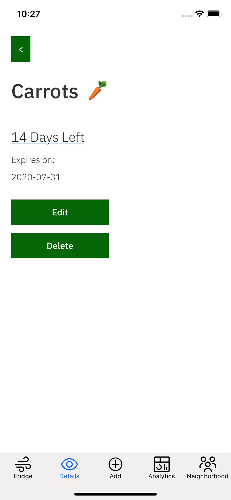
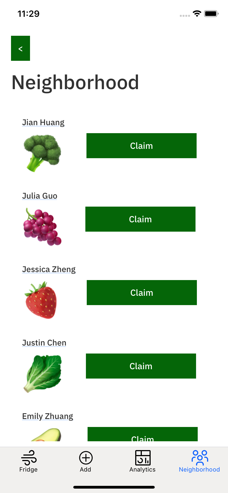

# apples 🍎 & oranges 🍊


## Authors
* Justin Chen
* Julia Guo
* Jian Huang
* Emily Zhuang
* Jessica Zheng

## Contents

1. [The Problem](#the-problem)
2. [Our Solution](#our-solution)
3. [Our Codebase](#our-codebase)
4. [How to Run](#how-to-run)

## Video 

Learn more about our project [here](https://youtu.be/BTWsBLcq9Wg)!

## The Problem

### The Bigger Picture

About 11% of all the greenhouse gas emissions that come from the food system could be reduced if we stop wasting food. In the US alone, the production of lost or wasted food generates the equivalent of 37 million cars’ worth of greenhouse gas emissions. [(source)](https://www.worldwildlife.org/stories/fight-climate-change-by-preventing-food-waste#:~:text=When%20we%20waste%20food%2C%20we,more%20potent%20than%20carbon%20dioxide)

In the United States, food waste is estimated at between 30–40 percent of the food supply. [(source)](https://www.fda.gov/food/consumers/food-loss-and-waste) 

### On the Individual Scale

* People think they will eat everything they buy, but they cannot
* People have little time in the day to cook fresh meals
* People are busy with work, children, etc.
* People often forget about what they have in the fridge
* Fridges and pantries can disorganized
* Food storage is often times first-in-last-out, and there is little space

## Our Solution
### Overview
apples & oranges aims to solve the larger issue of climate change by providing the tools for users to reduce individual waste. Not only is it geared to climate-enthusiasts who want to minimize their waste, but also everyday consumers that wish to save money. apples & oranges appeals to a wide user base, thereby reducing more food waste regardless of the user's interest in reducing climate change.

### Fridge/Pantry 
The interface allows users to conveniently keep track of all of their food. The Fridge sorts food items so that the user can quickly see the "high-priority" items that will need to be consumed soon. Adding, viewing, editing, and deleting food items is simple to use and requires minimal effort. 
<div>



</div>

### Analytics
The Analytics page gives users insight on their waste and impact on the climate. Users are able to see commonly wasted foods and high-impact foods purchased.


### Community Initiative
The Community page enables users to quickly offer items to neighbors and friends. Not only does this minimize the user's food waste, but also inspire a collective call for change in reducing greenhouse gas emissions.



## Our Codebase
```
/apples-and-oranges
  \____ /mobile-app
          \____ /src
                  \____ /screens
                /ios
                  \____ /Pods
                /android
                /node_modules
  \____ /server-app
          \____ /foodServer.js
          \____ /foodStore.json
          \____ /node_modules
```

## How to Run

### 1. Clone the repository
1. In terminal: `git clone https://github.com/EEZhuang/ibm-hack-2020.git`

### 2. Install dependencies 
- Node.js https://nodejs.org/en/
- Watchman https://facebook.github.io/watchman/
- Xcode https://itunes.apple.com/us/app/xcode/id497799835?mt=12
- Cocoapods https://guides.cocoapods.org/using/getting-started.html

### 3. Run the Server

To set up and launch the server application, from a terminal:
1. Go to the `server-app` directory of the cloned repo.
2. Install the dependencies: `npm install`.
3. Launch the server application locally or deploy to IBM Cloud:
    - To run locally:
        1. Start the application: `npm start`.
        2. The server can be accessed at http://localhost:3000.
    - To deploy to IBM Cloud:
        1. Log in to your IBM Cloud account using the IBM Cloud CLI: `ibmcloud login`.
        2. Target a Cloud Foundry org and space: `ibmcloud target --cf`.
        3. Push the app to IBM Cloud: `ibmcloud app push`.
        4. The server can be accessed at the URL shown in the console (`routes`) after the app successful uploads and starts (for example,  https://solution-starter-kit-disasters-2020-server-random-route.bluemix.net).

### 4. Run the Mobile Application

To run the mobile application,  from a terminal:
1.  Go to the `mobile-app` directory.
1. Install the dependencies: `npm install`.
1. Go to the `ios` directory: `cd ios`.
    1. Install pod dependencies: `pod install`.
1. Return to the `mobile-app` directory: `cd ../`.
1. Launch the app in the simulator/emulator: `npm run ios`
